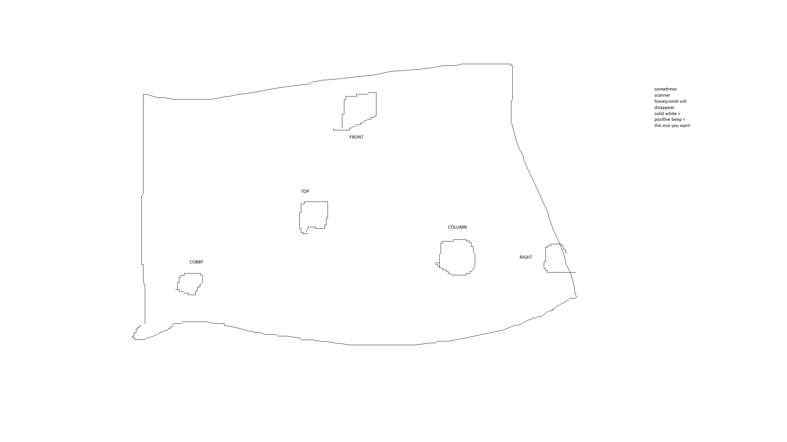

Vesper's Host
=============

Traversal: Airlock
------------------

Encounter 1: Reboot
-------------------

Resists: Arc, Solar, Sniper

brain: wall 1, wall 2, column, nuke {left, top, right}

lungs: door, corner, crates, front, wall 2 (nearest front), wall 1 (nearest door)

heart: right corner, column door, column front, door left, door right, left corner

Traversal
---------

Encounter 2
-----------

1. grab and store operator in the terminal downstairs
2. kill the machine priest and go upstairs
3. grab surpressor and right after bombs drop it so you dont' die
4. the ball will split in to 10 servitors, you are looking for the two that have lit circles in front of them
5. get the numbers of the servitors
6. you will get two each cycle, you need 4 numbers to cause a split, don't shoot any panels until you've got 4 numbers
7. go down, shoot the control panels you recorded with operator
8. all the enemies will despawn, the giant ball will come down, you will need to grab surpressor, do the split thing again
   and do damage
9. repeat until boss is dead

Servitors read off the lights on their face like this::

        o (1)
  (8) o   o (2)
        o (4)
        
  add the numbers together

so for example, if the top circle and the left circle are lit, that is servitor number 9.

top and bottom is number 5

right and left is number 10

Traversal
---------

Encounter 3
-----------
